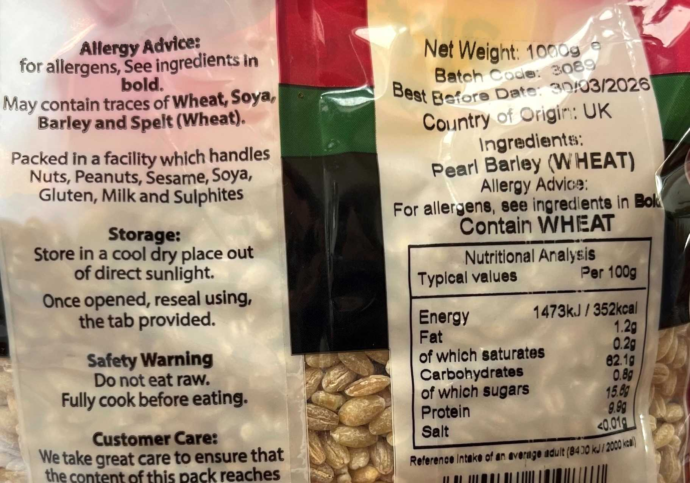

# 参考（Reference）

参考指南是机制及其操作方法的**技术说明**。参考资料**以信息为导向**。

---

参考材料包含用户在工作中寻求的命题（propositional）或理论（theoretical）知识。

参考指南（reference guide）的唯一目的是尽可能简洁、有序地进行描述。教程和操作指南的内容以用户的需求为主导，而参考材料则以它所描述的产品为主导。

就软件而言，参考指南描述了软件本身（API、类、函数等等）以及如何使用它们。

您的用户需要参考资料，因为他们需要真理和确定性 —— 支撑他们工作的坚实平台。良好的技术参考对于让用户有信心完成工作至关重要。

## 描述作为参考

参考材料描述机制，它应该是严肃的。人们几乎不阅读参考资料，而是查阅它。

所指内容不应有任何疑问或含糊之处，它应该是完全权威的。

参考资料就像地图一样。地图会告诉您需要了解的关于该领土的信息，而无需亲自出去查看该领土；面向产品及其内部机制的参考指南也具有相同特点。

尽管参考不应试图展示如何执行任务，但它可以且通常需要包含某些内容如何工作或使用它的正确方法之类的描述。

> 不幸的是，太多的软件开发人员认为自动生成的参考材料就是所需的所有文档。

一些参考材料（例如 API 文档）可以由它所描述的软件自动生成，这是确保其忠实准确于代码的有效方法。

## 主要原则

### 描述并且仅描述

中性描述是技术参考的关键。

> * 风格和形式
>   * 严肃，不妥协
>   * 中立、客观、真实
>   * 根据机制本身的结构进行构造

不幸的是，最难做的事情之一就是中立地描述某件事，这不是一种自然的交流方式。另一方面，解释、指导、讨论、发表意见是很自然的，所有这些都与技术参考的需求背道而驰，而技术参考要求的是准确、精确、完整和清晰。

引入指导和解释可能很有诱惑力，这只是因为描述似乎不够有用，而且我们确实需要这些其他东西。相反，您应该链接到操作指南（how-to guides）、解释（explanation）和入门教程（introductory tutorials）。

### 采用标准模式

**如果参考资料前后一致，就会很有用。**标准模式使我们能够有效地使用参考材料。您的工作是以用户熟悉的格式将用户需要的材料放置在他们希望找到的位置。

写作中有很多机会可以通过丰富的词汇量和对多种风格的掌握来取悦读者，但参考材料中绝对不要这么做。

### 尊重机制的结构

地图与其所代表的领土相对应的方式，有助于我们利用前者在后者中找到方向。文档也应如此：文档的结构应与产品的结构相对应，这样用户才能同时了解它们。

这并不意味着强迫文档采用不自然的结构。重要的是代码中的逻辑、​​概念安排和关系应该有助于理解文档。

### 提供示例

举例说明是一种很有价值的说明方法，既能帮助读者理解参考文献，又能避免分散读者的注意力。例如，一个命令的用法示例可以简明扼要地说明该命令及其上下文，而不会落入试图解释或指示的陷阱。

## 参考指南的用语

1. Django 的默认日志配置继承了 Python 的默认配置。它可用作 `django.utils.log.DEFAULT_LOGGING` 并在 `django/utils/log.py` 中定义。
    * 陈述有关机制及其行为的事实。
2. 子命令有：a、b、c、d、e、f。
    * 列出命令、选项、操作、功能、标志、限制、错误消息等。
3. 您必须使用 a。除非满足 c 情况，否则您不得应用 b。从来不用 D.
    * 在适当的情况下提供警告。

## 以食品和烹饪为例

您可以检查食品包装上的信息，以帮助您决定该怎么做。

当您寻找信息（相关事实）时，您不想面对意见、猜测、指示或解释。

您还希望这些信息以标准方式呈现，（以便您在需要了解某物的营养特性、应如何储存、其成分、其可能对健康有何影响时）可以快速找到它们并了解您可以信赖它们。

例如，您希望看到：可能含有微量小麦。或：净重：1000 克。

您当然不会期望找到与此信息相混淆的食谱或营销声明，因为这可能会带来真正的危险。

在食品上展示参考资料的方式非常重要，通常会受到法律的约束，而所有参考文件也应具有同样的严肃性。
