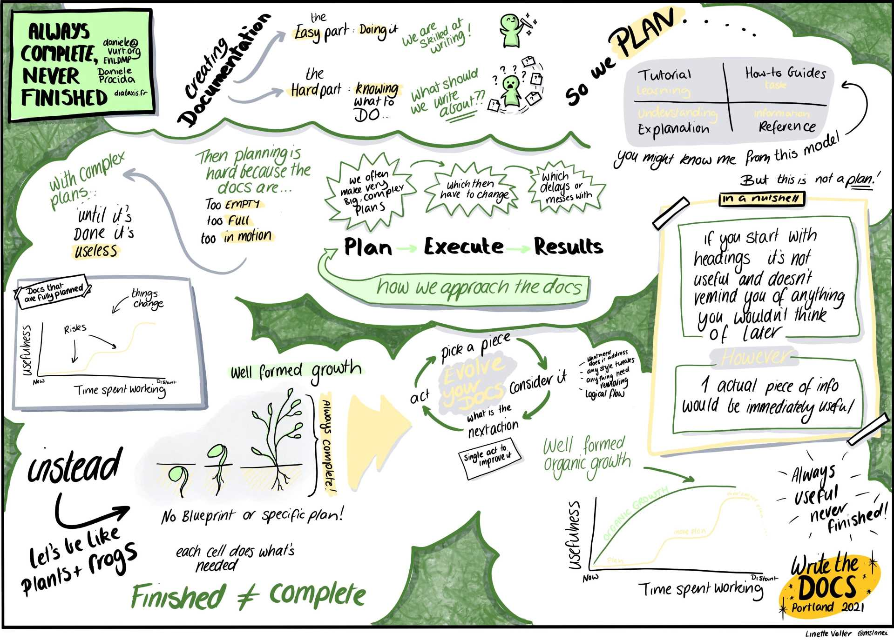

# 将Diátaxis 作为工作指南

除了提供文档内容指南外，Diátaxis 还提供文档流程和执行指南。

大多数从事技术文档工作的人必须在工作中决定如何工作。在某些情况下，文档必须一次性交付，并保持完整和最终状态，但更常见的情况是，文档是一个持续进行的项目，例如与产品同时开发，而产品本身也在不断演变和发展。许多从事文件编制工作的人都会发现自己有责任改进甚至修正某项工作。

Diátaxis 提供的工作方法与文档领域的许多公认智慧背道而驰。特别是，它不鼓励规划和自上而下的工作流程，而是倾向于小规模、反应迅速的迭代，并从中产生整体模式。

## 使用 Diátaxis 作为指南，而不是计划

Diátaxis 描述了文档的完整结构。然而，它提出的结构并不是一个**计划**，而是您必须在文档中完成的内容。它是一本**指南**，一张地图，可以帮助您检查您是否处于正确的位置并朝正确的方向前进。

Diátaxis 的目的是为您提供一种思考和理解文档的方法，以便您可以更好地理解它正在做什么以及您试图用它做什么。它提供了一些工具来帮助评估它，确定它的问题所在，并判断你可以采取哪些措施来改进它。

## 不用担心结构

尽管结构是文档的关键，但使用 Diátaxis 意味着不必花费精力尝试使其结构正确。

如果您继续按照 Diátaxis 提供的提示进行操作，您的文档最终将采用 Diátaxis 结构 —— 但它之所以采用这种结构，是因为它得到了改进，而不是反过来，为了改进文档而将结构强加给文档。

实际上，这意味着开始使用 Diátaxis 不需要考虑将文档分为四个部分，或者编写标题来分别放置资料。

相反，按照接下来两节中描述的工作流程，根据 Diátaxis 原则对您认为有改进机会的地方进行修改，这样文档就会开始形成一定的形状。到了一定阶段，您所做的修改似乎会要求您将材料移到某个 Diátaxis 标题下 —— 这就是您的顶层结构形成的过程。换句话说，Diátaxis 从内部改变了文档的结构。

## 一步一步地工作

Diátaxis 严格规定了文档的结构，但无论现有文档的状况如何（即使按照任何标准来看都是一团糟）都有可能通过迭代的方式加以改进。

有一个错误观点是：“在发布之前完成一大批工作是很自然的事情，这样您每次都可以展示一些实质性的东西。”避免这种诱惑！在正确方向上迈出的每一步都值得立即发表。

尽管 Diátaxis 的目的是提供文档的全貌，但不要试图在全貌上下功夫。这既没有必要，也没有帮助。Diátaxis旨在引导小步前进；不断迈出小步，才能到达你想去的地方。

## 只是做点什么

如果你正在收拾一个巨大的烂摊子，那么你很可能会把它全部推倒重来，应该要避免这种做法。就按照 Diátaxis 改进文档而言，没有必要寻找需要改进的地方。相反，应用 Diátaxis 的最佳方法如下：

* **选择某样东西。** 文档的任何一部分。如果你还没有自己想要纠正的问题，就不要去找未解决的问题。只要看看此时此刻你面前有什么：你正在处理的文件，你读过的最后一页，都没关系。如果没有，就随便选择一些内容。

* **评估它。** 接下来要认真考虑它。最好是小东西，不超过一页纸，或者更小，一段话或一句话。根据 Diátaxis 规定的标准对其进行质疑：它代表了用户的什么需求？它能多好地满足这一需求？为了更好地满足这一需求，可以添加、移动、删除或更改哪些内容？它的语言和逻辑是否符合这种文档模式的要求？

* **决定做什么。** 根据你对这些问题的回答来决定：根据您对这些问题的回答，决定做什么？

* **去做它。** 完成下一步哪一项行动，并将其视为已完成（即公布它，或至少承诺做出改变）。不要觉得要做出有价值的改进还需要做其他事情。

然后回到循环的开始。

这样的工作方式有助于减轻文件编写者的工作压力，因为文件编写者的工作中最瘫痪、最麻烦的一个方面就是：不知道该做什么。它能让工作朝着正确的方向进行，始终朝着预期的目标前进，而无需在计划上耗费精力。

## 让你的工作有机发展

为了取得成果，人们总是强烈要求在计划和执行的循环中工作。但这并不是唯一的方法，在文档工作中往往还有更好的方法。

### 结构良好的有机生长

**一个好的文档模型是适应外部条件的有序有机生长**。有机生长发生在细胞层面，有机体的整体结构是由细胞的健康发展来保证的，而细胞的健康发展是按照适合每种细胞的规则进行的。结构是从上面或外部强加给有机体的，而不是相反。良好的结构是从内部发展起来的。

文档也是如此：通过遵循 Diátaxis 提供的原则，您的文档将获得一个健康的结构，因为它的内部组件本身结构良好，就像一个活的有机体，它会从内到外构建自己，一个一次细胞。

### 已完成，未完成

考虑一株植物。作为一个活的、不断生长的有机体，植物一直在生长。它总是可以进一步发育，进入下一个生长和成熟阶段。但是，在它发育的每个阶段，从种子到完全成熟的树，它总是完整的，它永远不会缺少任何东西。在任何时候，它都处于与其发展阶段相适应的状态。

同样，文档也一直在生长，因为它总是要根据产品和用户的需求不断适应和变化，并且总是可以进一步开发和改进。

然而，它也可以一直是完整的：对用户有用，适合其当前的发展阶段，并且处于健康的结构状态并准备好进入下一阶段。
